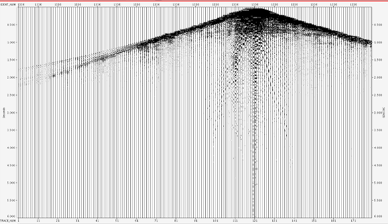

# 2D Subsurface Seismic Data Processing using OMEGA

## Project Overview
- **Role:** Geophysics Data Processing Intern 
- **Location:** Pertamina Upstream Technology Center (UTC), Jakarta
- **Software Framework:** Schlumberger OMEGA Software & PickWorks Lite
- **Key Expertise:** Non-Destructive Evaluation (NDT), Digital Signal Processing (DSP), Wave-Based Anomaly Detection, Visual Data QA/QC

---

## The Challenge (Why this project matters)
When geophysicists acquire data in the field, the raw recordings look completely chaotic and are heavily contaminated by environmental noise, surface weather effects, and signal degradation. You cannot see the subsurface structures at all from raw data. 

My goal during this industrial internship was to take a raw 2D SEG-Y dataset and guide it through a comprehensive data-cleaning, signal-conditioning, and imaging pipeline. The ultimate objective was to isolate true acoustic reflections and build a high-resolution sub-surface cross-section ready for structural interpretation.

---

## The Workflow & Methodology (How I did it)

I built the processing sequence following industrial standards, dividing the work into four major phases:

### 1. Preprocessing & Data Ingestion
- **Reformatting:** Converted the raw field data from SEG-Y format to `.DIO` production format to work within the OMEGA architecture.
- **Geometry & Navigation Assignment:** Integrated the raw seismic traces with coordinate survey files (ASCII) to give each shot and receiver its true spatial identity.

### 2. Signal Conditioning & Noise Attenuation (Data Cleaning)
- **True Amplitude Recovery (TAR):** Mathematically compensated for wave energy loss caused by spherical divergence as the signal travels deeper into the earth.
- **Anomalous Amplitude Attenuation (AAA):** Deployed a moving-window filtering algorithm to automatically isolate and strip away high-energy random ambient noise spikes.
- **Predictive Deconvolution:** Configured a 32-ms operator window to eliminate source wavelet signatures and suppress multiple reflections, significantly sharpening the data resolution for deeper layers.

### 3. Static Corrections & Iterative Imaging (The Core Task)
- **First-Break Picking:** Hand-picked thousands of initial wave arrivals to calculate and apply refraction static corrections, completely removing the distortion caused by topography and the soft near-surface weathered soil layers.
- **Iterative Velocity Analysis:** Conducted three rigorous rounds of velocity picking based on energy semblance plots. The goal was to align Common Midpoint (CMP) reflection paths into flat, perfectly horizontal lines.
- **Residual Statics:** Applied multiple passes of surface-consistent residual static corrections to fix short-wavelength timing shifts that standard corrections missed.

### 4. Advanced Amplitude Compensation & Migration
- **SCAC (Surface Consistent Amplitude Compensation):** Corrected localized shadowing effects caused by dense near-surface hard rock formations, successfully recovering lost reflections below the 1000ms depth boundary.
- **Pre-Stack Time Migration (PSTM):** Relocated dipping subsurface reflectors to their true geometric coordinate positions and collapsed wave diffraction artifacts while fully preserving the true physical amplitude values.

---

## Technical Visual Gallery & Results

### 1. The Processing Pipeline
Below is the exact functional workflow configuration I implemented during the project:

### 2. The Raw Starting Point vs. Interactive Analytics
We start with highly distorted wave gather files (left). During the process, I used OMEGA's interactive velocity validation windows (right) to ensure precision matching of the energy fields:

| Raw Shot Gather (SEG-Y to DIO) | Velocity Analysis Semblance Screen |
|---|---|
|  |  |

### 3. Final Production Sections
The final results yielded two distinct high-integrity sub-surface cross-sections:
- **Preserved Amplitude Section (TVF applied):** Retains original physical wave reflectivity values, perfect for advanced fluid/AVO attributes evaluation.
- **Non-Preserved Amplitude Section (AGC applied):** Dynamically scales amplitudes globally, making structural horizons exceptionally clear for direct geologic mapping.

| Preserved Amplitude (Final Target Display) | Interpretable Structure (AGC Balanced) |
|---|---|
|  |  |

---

## Key Takeaway & Professional Competencies
This industrial project reflects my foundational approach to handling complex data and engineering workflows:
- **Data Integrity & QA/QC Discipline:** Spent extensive hours cleaning noisy datasets and validating intermediate stages. I understand that the quality of any automated system or interpretation depends entirely on the cleanliness of the input data.
- **Methodological Adaptability:** Learned to navigate proprietary industrial software architectures (Schlumberger OMEGA) and adjusted signal processing parameters dynamically based on data anomalies.
- **Analytical Stamina:** Accustomed to reviewing massive, continuous time-series configurations and extracting clear, actionable spatial patterns from highly abstract visual inputs.

**Note on Documentation:** The full technical report inside the `documentation/` folder is maintained in its original language (Bahasa Indonesia) to preserve official corporate signs and university validation stamps. All core methodologies, processing algorithms, and visual highlights are fully summarized above in English.
