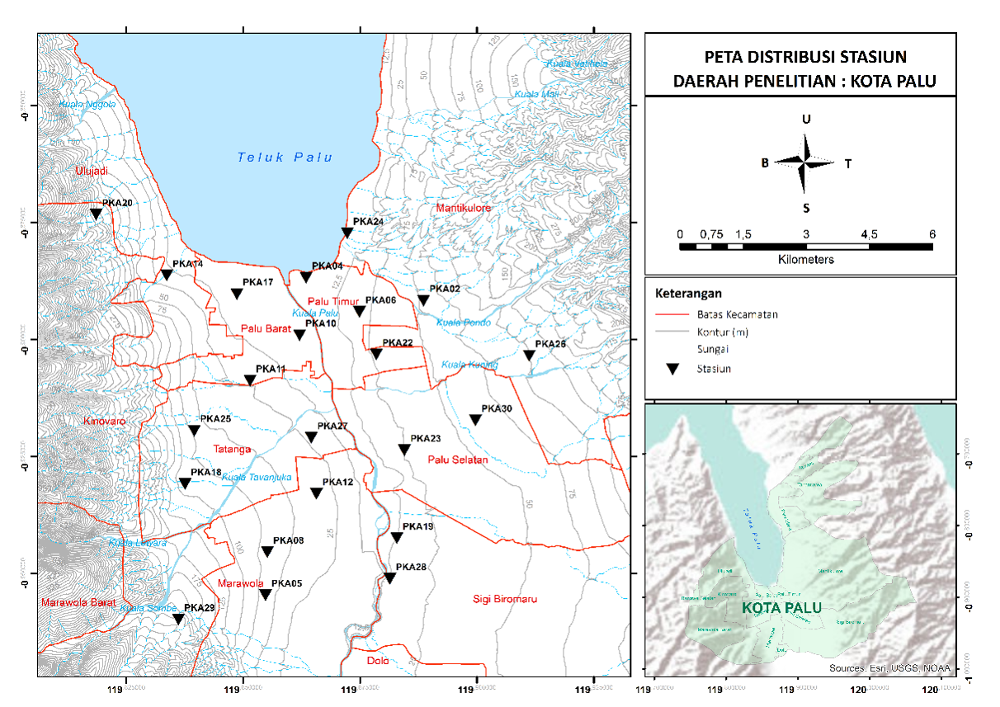
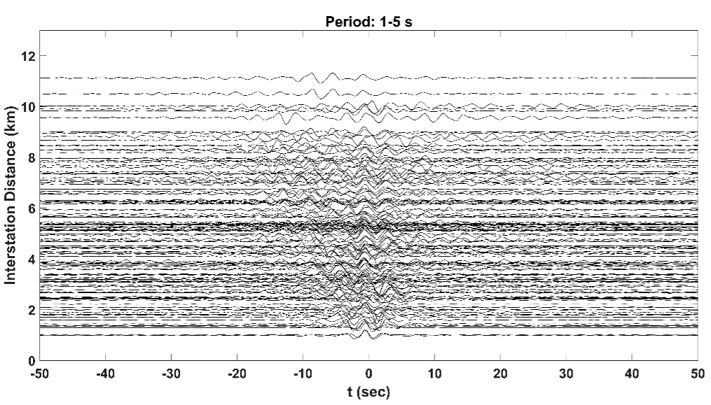
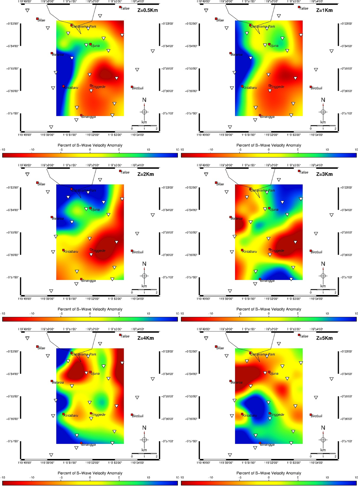

# Shear Wave Velocity Structure Construction Using Ambient Seismic Noise Tomography (ANT)

> **Official Publication:** This research was peer-reviewed and published in the *Jurnal Geofisika (2019) Vol. 17, No. 02, pp. 1-4* by the Indonesian Association of Geophysicists (HAGI).
> 
> *Note on Documentation: The full published paper inside the `documentation/` folder is maintained in its original language (Bahasa Indonesia) to preserve publishing formats. A comprehensive English technical summary is provided below.*

---

## Project Overview
- **Core Methodology:** Ambient Seismic Noise Tomography (ANT), Seismic Interferometry
- **Key Algorithms:** Frequency-Time Analysis (FTAN), Linear Inversion, Particle Swarm Optimization (PSO)
- **Technical Framework:** Seismological Wave Processing Tools (Yao et al., 2006; Yudistira et al., 2017)
- **Competencies:** Digital Signal Processing (DSP), Computational Inverse Modeling, Spatial Data Grid Analysis

---

## The Research Challenge (The "Why")
Traditional active seismic surveys require high-energy, artificial subsurface inputs (such as explosives), which are logistically restrictive and heavily disruptive in populated urban environments. However, understanding shallow subsurface shear-wave velocity frameworks (\(Vs\)) is critical for seismic hazard studies, especially in tectonically active zones like the Palu-Koro Fault system—responsible for the catastrophic 7.5 Mw Palu Earthquake in 2018.

To resolve this restriction, this project utilized **Ambient Seismic Noise Tomography (ANT)**. Instead of active blasts, ANT treats continuous, random environmental background "noise" (ocean waves, traffic, wind) as coherent wave signals. By cross-correlating background data across pairs of recording stations, we can mathematically reconstruct the subsurface response as if a virtual source was placed at one station, mapping high and low-velocity structural hazards beneath the city.

---

## Computational & Methodological Workflow (The "How")

The continuous vertical-component seismic data from **22 station networks in Palu** (recorded over a 3-month cycle) was processed through a rigid macro-scale wave-processing sequence:

### 1. Single-Station Signal Conditioning
- Applied rigorous automated signal preprocessing: **demeaning, detrending, and bandpass filtering** within a target frequency window of 0.5 – 6 seconds.
- Deployed **one-bit temporal normalization** and **spectral whitening** to eliminate localized earthquake artifacts and specific harmonic ambient contaminations, isolating true surface Rayleigh waves.

### 2. Cross-Correlation & Daily Stacking
- Computed cross-correlation functions (CCF) across interstation networks, establishing **212 unique station-pair signal tracks**.
- Consolidated long-term continuous records by stacking daily  correlations to isolate coherent Empirical Green’s Functions.

### 3. Dispersion Curve Extraction via FTAN
- Executed **Frequency-Time Analysis (FTAN)** to map Rayleigh wave group velocity variations (ranging between 0.2 to 2.0 km/s).
- Enforced automated Quality Control constraints: extracted data paths strictly requiring a Signal-to-Noise Ratio (SNR) > 5 and interstation distance paths exceeding 1x wavelength.

### 4. Tomographic Grid Inversion & Inversion Modeling
- Performed spatial tomographic linear inversions using an 8x8 gridding matrix with fine-tuned smoothing and damping parameters based on L-curve trade-off metrics.
- Validated lateral sub-surface structural boundaries using standard **Checkerboard Resolution Tests** to confirm grid stability.
- Executed deep non-linear 1D profile transformations on high-integrity grids via **Particle Swarm Optimization (PSO)** algorithms to evaluate localized layer thickness and compute the final 3D Shear Wave ($Vs$) velocity mapping down to a depth of 5 km.

---

## Technical Visual Gallery & Research Results

### 1. Network Array & Empirical Signal Reconstruction
The monitoring foundation utilized a 22-station array across the Palu fault basin (left). Long-term daily signal stacking successfully extracted high-clarity dispersive energy paths plotted as a functional Cross-Correlation Gather (right):

| 22-Station Seismometer Layout Map | Cross-Correlation Signal Gather (V-Shaped Wavefront) |
|---|---|
|  |  |

### 2. Grid Optimization & Structural Tomography
To secure publication-grade model accuracy, a Checkerboard Test (left) validated structural grid sensitivity boundaries. The final inversions mapped 3D Shear Wave configurations (right), pinpointing clear physical velocity anomalies across critical horizons:

| Checkerboard Grid Resolution Test | Final Shear Wave ($Vs$) Velocity Tomography Maps (0.5-5km) |
|---|---|
|  |  |

---

## Key Takeaway & Professional Competencies
This publication demonstrates an advanced command over abstract data arrays and numerical workflows:
- **Advanced Signal Processing:** Experienced in configuring statistical wave-filtering pipelines (spectral whitening, deconvolution, normalization) to pull weak structural markers out of highly noisy environments.
- **Computational Inverse Modeling:** Proficient in designing multi-stage gridded boundary inversions and utilizing global meta-heuristic search algorithms (like Particle Swarm Optimization) to solve non-linear optimization tasks.
- **Analytical Precision:** Accustomed to enforcing strict mathematical QC filters (SNR checks, grid independence, trade-off analysis) to ensure the integrity of final visual metrics against rigorous peer-review evaluation.
