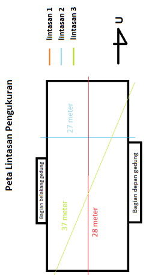
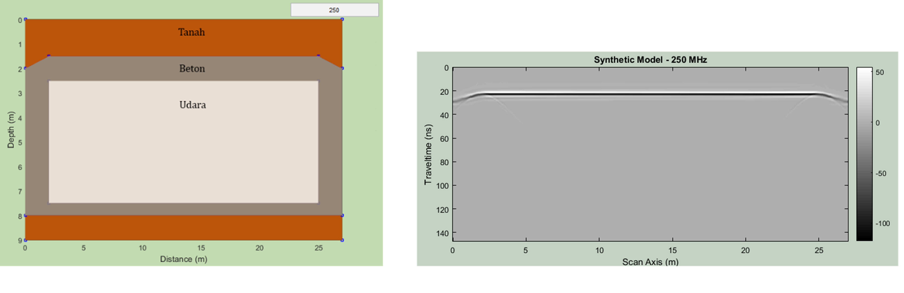

# Buried Structure Detection using Ground Penetrating Radar (GPR): Case Study Bunker at ITB Campus

> *Note on Documentation: The complete research manuscript is available as a PDF in the `documentation/` folder.*

---

## Project Overview
- **Core Methodology:** Ground Penetrating Radar (GPR), Electromagnetic Wave Propagation
- **Software Framework:** ReflexW (Data Processing), Forward Modeling Suites
- **Instrumentation:** MALA Shielded Antenna (250 MHz frequency core)
- **Key Competencies:** Numerical Forward Modeling, Signal-to-Noise Ratio (SNR) Optimization, Electromagnetic Permittivity Analysis, Spatial Structural Evaluation

---

## The Research Challenge (The "Why")
Natural disasters like heavy earthquakes can trigger liquefaction—a destructive phenomenon where saturated soil temporarily loses its structural strength and behaves like a dense liquid. During the 2018 Palu earthquake, liquefaction caused thousands of buildings to sink and become trapped near the surface, complicating rescue operations and disaster management. 

To solve the challenge of locating these hidden hazards, this project uses a high-frequency Ground Penetrating Radar (GPR) survey over a known historical underground bunker at the ITB campus as a mechanical analogy. By analyzing how electromagnetic pulses bounce off hidden materials, we can map shallow subsurface anomalies (like concrete-air interfaces) non-destructively without any excavating or drilling.

---

## Data Processing & Simulation Framework (How I did it)

The project workflow was divided into two strategic parts: validating the expected radar signatures through predictive modeling, and refining the raw field datasets.

### 1. Predictive Forward Modeling (Survey Design & QA/QC)
Before scanning the field, I built multiple synthetic subsurface models to simulate electromagnetic responses across variable boundaries. I calibrated the material parameters using known physical properties:
- **Soil Matrix:** Resistivity = 1,000 Ohm·m, Dielectric Constant = 5
- **Concrete Shell:** Resistivity = 5,000 Ohm·m, Dielectric Constant = 4.5
- **Internal Air Void:** Resistivity = 10¹⁵ Ohm·m, Dielectric Constant = 1

By simulating a homogeneous earth layer, a multi-layer model, and eventually a real concrete-air bunker structure, I established a clear visual baseline of the expected diffraction hyperbolas.

### 2. Field Data Acquisition & Signal Conditioning
I executed a multi-directional field survey using a 250 MHz MALA shielded antenna across three high-coverage trajectories:
- **Line 1 (North-South):** 27 meters
- **Line 2 (Southwest-Northeast):** 37 meters
- **Line 3 (East-West):** 28 meters

The raw reflection tracks were processed through a digital signal conditioning sequence in ReflexW:
- **Dewow Filter:** Stripped away low-frequency electromagnetic background drift and instrumentation noise.
- **Butterworth Bandpass Filter:** Isolated a targeted frequency window between 100 Hz to 300 Hz to maximize the Signal-to-Noise Ratio.
- **Automatic Gain Control (AGC):** Amplified weak, attenuated electromagnetic signals from deeper boundaries to reveal the lower edges of the asset.
- **Time-to-Depth Conversion & Time Cut:** Focused the interpretation grid strictly down to the target boundaries.

---

## Technical Visual Gallery & Research Results

### 1. Survey Trajectory & Layout Design
The high-coverage spatial layout across the test site field was mapped using three intersection lines to ensure cross-sectional data validation:

### 2. Forward Modeling Baseline (Synthetic Response)
Below is the optimized synthetic forward model representing the real concrete-air boundary of the bunker (left) and its resulting synthetic radargram wave response (right), showing clear reflectivity shifts at the material edges:

### 3. Processed Field Data & Anomaly Detection
The processed real-world radargrams across all three survey trajectories mapped a distinct, strong continuous reflector at a shallow depth of 0.6 to 1.3 meters. The distinctive diffraction patterns (marked by red boundary boxes) pinpointed the exact structural edges and concrete thickness (~0.5 - 0.7 meters) of the buried building:

---

## Key Takeaway & Professional Competencies
This project showcases my ability to connect theoretical physics models with field data execution:
- **Data-Driven Quality Control:** Experienced in using forward modeling and synthetic data as a control benchmark to validate real-world data collection and prevent data misinterpretation.
- **Electromagnetic Data Interpretation:** Proficient in processing raw radar traces, managing wave amplification loops, and reading complex geometric anomalies (like diffraction hyperbolas).
- **Meticulous Parameter Calibration:** Skilled in configuring digital signal filters (bandpass, dewow, AGC) based on specific material properties and frequency targets to isolate critical structural anomalies.

