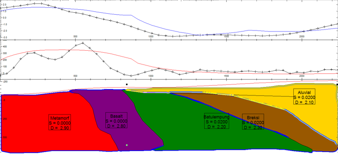
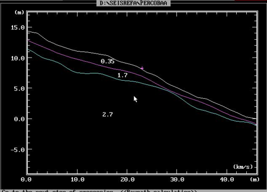
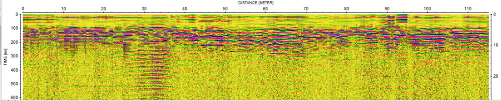

# Multi-Method Geophysical Integration & Fieldwork Mapping: Karangsambung Structural Validation & Landslide Hazard Assessment

## Project Overview
- **Type:** Intensive Geophysical & Geological Fieldwork (TG-3290)
- **Field Locations:** Northern Complex (Structural Mapping) & Southern Zone (Desa Seling Landslide Assessment), Kebumen, Indonesia
- **Integrated Methods:** 
  - *Deep/Regional Tools:* Gravity (Gaya Berat), Ground Magnetics
  - *Shallow/Near-Surface Tools:* DC Resistivity (Geolistrik Profiling & VES), Seismic Refraction, Frequency-Domain Electromagnetics (EM), Ground Penetrating Radar (GPR)
- **Core Competencies:** Multi-Method Data Integration, Geophysical Joint Modeling, Geological Field Mapping, Near-Surface Hazard Assessment, Signal-to-Spatial Inversion

---

## The Fieldwork Challenge (The "Why")
Karangsambung is internationally recognized as a highly complex tectonic playground, serving as a classic example of an ancient subduction accretionary prism (The Luk Ulo Melange Complex). The region features heavily chaotic stratigraphy, intense folding, fault systems, and sudden lithological shifts ranging from soft marine clays to dense, deeply-rooted metamorphic rocks and ophiolite blocks.

This professional field project aimed to tackle two distinct engineering and environmental challenges by deploying a combined suite of 6 geophysical methods to support physical geological mapping:

1. **Northern Zone Challenge (Structural Verification):** Validate a blind fault system and outline structural lithological boundaries hidden beneath dense alluvial cover by integrating potential field methods (Gravity and Magnetics).
2. **Southern Zone Challenge (Landslide Hazard Assessment):** Map a critical active landslide zone in Desa Seling. The objective was to non-destructively image the subsurface boundary where permeable breccias overlay an impermeable clay layer, creating a prone slip surface.

---

## Integrated Survey Design & Technical Workflow (The "How")

### Phase 1: Potential Field Structural Exploration (Northern Zone)
- **Gravity Field Mapping:** Deployed a closed-loop drift configuration across localized grid arrays and targeted profiles. Processed raw datasets to calculate the Complete Bouguer Anomaly (CBA), separating regional deep-seated trends from shallow anomalies using a Moving Average spectral filter.
- **Ground Magnetic Survey:** Collected total magnetic field tracking, applied International Geomagnetic Reference Field (IGRF) diurnal corrections, and transformed dipole fields into clear residual anomaly maps.
- **2D Joint Inversion:** Built tightly constrained subsurface cross-sections down to a depth of 500 meters using Model Vision software, co-interpreting density ($2.2 - 2.9 \text{ g/cm}^3$) and magnetic susceptibility markers.

### Phase 2: High-Resolution Near-Surface Imaging (Southern Hazard Zone)
- **DC Resistivity (Profiling & VES):** Executed a 95-meter 2D Wenner array alongside 1D Schlumberger Vertical Electrical Soundings (VES). Inverted the voltage inputs via RES2DINV and IP2WIN to identify structural water-saturation horizons and localized roots.
- **Seismic Refraction:** Laid out a 24-channel receiver array utilizing a high-energy sledgehammer source configuration. Conducted first-break travel-time picking in Vista and inverted velocity layers in Seisrefa to map structural weathering boundaries ($0.35 - 2.7 \text{ km/s}$).
- **Electromagnetics & GPR:** Ran high-frequency continuous EM conductivity loops mapped alongside a 100-meter 250 MHz MALA shielded GPR antenna layout. Processed the electromagnetic radargrams in ReflexW (dewow, AGC, bandpass, background removal, and F-K migration) to scan for structural voids and shallow soil displacement.

---

## Technical Visual Gallery & Research Results

### 1. Northern Zone Structural Mapping (Joint Inversion Model)
In the Northern zone, our field structural mapping identified steep contour alignments, pointing toward a right-lateral strike-slip fault system. This structural constraint was successfully verified through 2.5D potential field forward modeling. The gravity and magnetic responses perfectly capture the high-density, high-susceptibility basement block of the Luk Ulo Metamorphic Complex ($2.9 \text{ g/cm}^3$) abutting soft, low-density sediment layers:

### 2. Near-Surface Landslide Failure Plane Evaluation (Southern Zone)
In the Southern landslide zone (Desa Seling), we integrated multiple shallow sensors. The 2D Resistivity pseudosection (top) revealed localized low-resistivity water seepage pathways within the upper weathered soil layer. Simultaneously, the Seismic Refraction velocity modeling (middle) accurately mapped the transition from loose soil ($0.35 - 0.61 \text{ km/s}$) to the underlying rigid, unweathered volcanic breccia bedrock ($2.3 - 2.7 \text{ km/s}$) at a stable depth of ~4 meters. The high-resolution GPR profiles (bottom) mapped localized reflector depressions and soil displacement between the 40 to 70-meter marks:

| Method Framework | Processed Subsurface Profiling Sections |
|---|---|
| **2D DC Resistivity Profiling** |  |
| **Seismic Refraction Layer Modeling** |  |
| **2D Electromagnetic Radargram (GPR)** |  |

> 🔍 **Integrated Landslide Diagnostic:** While seismic refractions mapped the rigid top-of-breccia boundary at 4m depth, the lower landslide slip surface (the contact between the breccia and the deep underlying clay) could not be imaged by refraction tools. This is a classic geophysical velocity inversion challenge (where a slower layer like clay sits beneath a faster layer like breccia), meaning the acoustic signals refract downwards instead of returning to the surface. This insight highlights the critical importance of utilizing multi-method constraints to understand complex site conditions.

---

## Key Takeaway & Professional Competencies
This multi-method field deployment directly demonstrates my capacity to handle real-world operational challenges:
- **Advanced Data Integration:** Highly skilled in cross-referencing multiple separate physical parameters (density, magnetic susceptibility, electrical resistivity, and acoustic wave velocities) to eliminate ambiguity and construct a cohesive subsurface model.
- **Field Leadership & Resilience:** Experienced in managing field equipment logistics, planning survey trajectories, and executing loop validations under complex topographic and urban conditions.
- **Practical Troubleshooting:** Understand the concrete physical and mathematical limitations of different instrument arrays (such as the velocity inversion bottleneck in seismic refraction), allowing me to choose and adjust alternative engineering methods effectively based on localized conditions.
