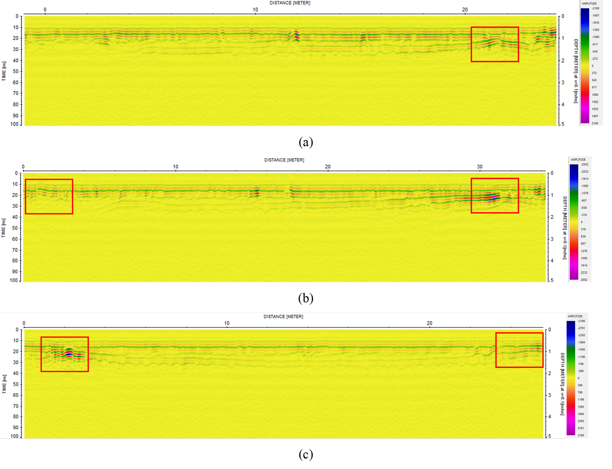

# Buried Structure Detection with Ground Penetrating Radar (GPR): Case Study of a Bunker at the ITB Campus

A GPR study I led as first author, written up as a paper with four co-authors: Fashli Adli W. I., Rizky Huthama Arsyad, M. Hafiyyan Fikri, M. Deddy Zainal and Raisha Pradisti, Bandung Institute of Technology. Title: *Buried Structure Detection using Ground Penetrating Radar: Case Study Bunker at ITB Campus.*

> **Note on documentation:** The paper in the `documentation/` folder is written in English. This was a group study, so the work below was shared with my co-authors.

---

## Project overview

| | |
|---|---|
| **Question** | Can GPR find a buried structure and its depth, and does the field data match what a forward model predicts? |
| **Method** | GPR survey with forward modelling of the expected response |
| **Site** | Field above the Industrial Metrology Laboratory (FTMD, ITB), Bandung; survey in October 2018 |
| **Target** | A buried bunker, with its top assumed at about 0.8–1.5 m depth |
| **Instrument** | MALA shielded antenna, 250 MHz |
| **Software** | ReflexW for the field data; the forward-modelling software is not named in the paper |
| **Survey** | Three lines: Line 1 (N–S) 27 m, Line 2 (NE–SW) 37 m, Line 3 (E–W) 28 m |

## Why this study

The 2018 Palu earthquake (7.4 Mw in this paper) caused liquefaction that, according to the paper, swallowed about 1,700 buildings and houses. We used a known buried structure, the bunker, as an analogue for finding structures buried by liquefaction (or historical buildings) without digging. GPR works when the target and the surrounding soil differ in dielectric constant, as concrete and soil do.

**Aims:** determine the depth of the bunker, and compare the anomalous response in the measurements with the forward-modelling results.

## What we did

### 1. Forward modelling (before the survey)
We built four synthetic models to see the expected response, and to use later as a quality-control reference:

1. a homogeneous soil model
2. a two-layer model (soil over concrete)
3. a three-layer model (soil, concrete, soil)
4. a model of the bunker (soil, concrete and air), closest to the real structure

Material parameters:

| Material | Resistivity (Ω·m) | Dielectric constant |
|---|---|---|
| Soil | 1,000 | 5 |
| Concrete | 5,000 | 4.5 |
| Air | 10¹⁵ | 1 |

### 2. Field survey
We measured with the 250 MHz MALA shielded antenna along three lines (see above). The survey layout is Figure 2 of the paper.

### 3. Processing in ReflexW
Four stages:

1. **Dewow filter**: removes low-frequency noise.
2. **Butterworth band-pass filter**: improves the signal-to-noise ratio (range 100–300, see the paper).
3. **Automatic gain control (AGC)**: strengthens weak amplitudes.
4. **Time cut**: focuses the result on the target depth (around 10 m here).

## Visual gallery

### Survey layout


### Forward model of the bunker and its synthetic response


### Processed radargrams of the three lines
Red boxes mark the edges of the structure.



## Results

- A clear reflector appears at about **0.6–1.3 m** depth in the radargrams, which we interpret as the top of the concrete of the buried building.
- The concrete layer is about **0.5–0.7 m** thick.
- Strong reflectors at the south end of Line 1 and the north-east end of Line 2 are interpreted as construction at the front of the building; a strong reflector in the western part of Line 3 as construction behind the building.
- Diffraction patterns appear at the edges of the structure (red boxes).
- The processed field data are consistent with the forward model of the bunker.
- We conclude that GPR can detect a buried structure near the surface, for example one caused by liquefaction or a buried historic building.

## Limitations

- One site, one antenna frequency and three lines. We did not check the depth or thickness independently.
- The comparison between forward model and field data is visual.
- The paper does not describe how travel time was converted to depth (for example the velocity used).
- This is a group study. See the paper's author list for the authors; I do not claim the whole work as mine.

## What I learned

- Planning a geophysical survey with forward modelling as a quality-control reference.
- Basic GPR processing (dewow, band-pass filtering, gain, time cut) in ReflexW.
- Interpreting radargrams and relating them to a physical model (dielectric contrast between soil, concrete and air).

## References

1. Conyers, L. B. (1995). The Use of Ground-Penetrating Radar to Map the Buried Structures and Landscape of the Ceren Site, El Salvador. *Geoarchaeology*, 10(4), 275–299.
2. Baker, G. S., Jordan, T. E. and Pardy, J. (2007). An introduction to ground penetrating radar (GPR). *GSA Special Papers*, 432, 1–18.
3. Hazen, A. (1918). A Study of the Slip in the Calaveras Dam. *Engineering News Record*, 81(26), 1158–1164.

## Folder contents

```text
.
├── README.md
├── documentation/   # the paper (PDF)
└── assets/          # figures used in this README
```

## Author

Fashli Adli Wal Ikhsan · [github.com/fashliadli](https://github.com/fashliadli)
