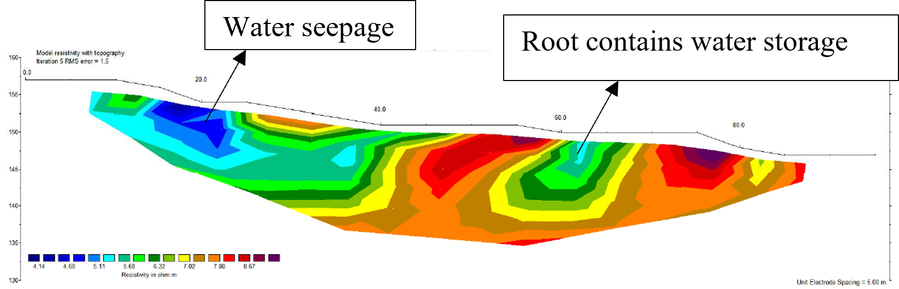

# Geology and Geophysics Field Course, Karangsambung (Kebumen, Central Java)

My report for the field course *Geologi dan Geofisika Daerah Karangsambung* (course TG-3290), Geophysical Engineering, Institut Teknologi Bandung, 2018. We collected the field data in groups; the report is mine.

> **Note on documentation:** The report in the `documentation/` folder is written in Bahasa Indonesia. Methods and results are summarised below in English.

---

## Project overview

| | |
|---|---|
| **Type** | Student field course: geological mapping plus geophysical surveys |
| **Areas** | North (structure mapping) and south (landslide at Desa Seling), Karangsambung, Kebumen |
| **Methods** | North: gravity, magnetics. South: DC resistivity (profiling and VES), seismic refraction, electromagnetics (EM), GPR |
| **Software** | Microsoft Excel, Surfer 11, Model Vision 13.00 (gravity, magnetics); RES2DINV, IP2WIN (resistivity); Vista, Seisrefa (seismic refraction); ReflexW (GPR) |
| **Result** | North: geophysics confirms the geological map. South: we did **not** find the landslide plane |

## Why Karangsambung

Karangsambung is a geologically unusual area: a Cretaceous to Paleocene subduction (accretionary) complex, the Luk Ulo Melange Complex, with rocks from sedimentary to igneous and metamorphic, and ophiolite blocks. It is often called one of the most complete geological fields in the world. The course let us practise the full survey cycle: acquisition, processing and interpretation.

## Two goals

| Area | Goal | Methods |
|---|---|---|
| **North** | Make a geological map and **confirm it with geophysics** | Gravity, magnetics |
| **South (Desa Seling)** | Find the **landslide plane**, expected at the contact between permeable breccia and claystone | Resistivity, seismic refraction, EM, GPR |

---

## What I did

### North: gravity and magnetics
- **Gravity:** two acquisition designs depending on terrain (profiles at fixed spacing in uneven terrain, grids in flat terrain), measured in closed loops. Corrections: tide, drift, latitude, free air, Bouguer and terrain, giving the Complete Bouguer Anomaly (CBA). The window width for regional/residual separation came from spectral analysis of slices; the regional anomaly came from a moving-average filter, and residual = CBA − regional.
- **Magnetics:** IGRF correction (ΔT = measured − IGRF), then the same regional/residual separation. In Model Vision I entered declination, inclination and total field so that the dipole anomaly could be handled as a monopole.
- **Modelling:** one west–east section modelled in Model Vision down to 500 m, using the residual anomalies and the geological map. Densities from Telford (1990).

### South: near-surface methods (data of groups 1, 7 and 8)
- **DC resistivity:** group 1 profiling (95 m, Wenner, N–S, 20 electrodes at 5 m) processed in RES2DINV; group 8 VES (Schlumberger, E–W, AB/2 1–50 m, MN/2 0.5–10 m) processed in IP2WIN with a two-layer model.
- **Seismic refraction:** group 1 (NW–SE, 24 receivers at 3 m, 5 shots, 1 ms) and group 8 (SW–NE, 24 receivers at 2 m, 5 shots, 2 ms); sledgehammer source, OYO McSeis recorder. Vista for filtering, gain and amplitude recovery and first-break picking; Seisrefa for the sections.
- **EM:** survey lines at 1 m interval; I mapped the conductivity column in Surfer with UTM coordinates.
- **GPR:** group 7 shielded antenna, 100 m N–S line, processed in ReflexW: static correction, dewow, AGC, band-pass, background removal, stacking, F-K filter, migration and topographic correction.

## Visual gallery

### North: joint gravity and magnetic model (W–E section)


### South: near-surface sections

| Method | Section |
|---|---|
| 2D DC resistivity |  |
| Seismic refraction |  |
| GPR |  |

---

## What I found

### North
- Gravity and magnetic anomaly maps correlate well with the geological map. High anomalies in the west are explained by metamorphic rock (density 2.9 g/cm³) and basalt (2.8); lower anomalies in the east by claystone, breccia and alluvium (about 2.1–2.3 g/cm³).
- Closely spaced contours in the north and north-west are interpreted as faults, matching the right-lateral faults on the geological map.
- The metamorphic rocks are probably part of the Luk Ulo Melange Complex.
- I conclude that gravity and magnetics confirm the geological map.

### South (Desa Seling)
- **Resistivity:** low resistivity in the south, interpreted as weathered soil wetted by rain, and a lower anomaly in the north, possibly a tree root. The 1D VES gave two layers: about 1.5 m thick with 20.4 Ω·m over a second layer of about 9.6 Ω·m, interpreted as saturated and non-saturated weathered soil.
- **Seismic refraction:** group 8 gave three layers (0.35, 1.7 and 2.7 km/s, dipping north-east); group 1 gave two layers (0.61 and 2.3 km/s). Interpreted as weathered soil over breccia, with breccia from about 4 m depth.
- **EM:** higher conductivity in the east (claystone) and lower conductivity in the centre (breccia), consistent with the geological map.
- **GPR:** a reflector sags at about 40–70 m, interpreted as a depression of the weathered layer; at about 90 m there is possibly a cavity.

### Integration
None of the four methods found the landslide plane. My report explains why:

- **Resistivity** showed only wet and dry weathered soil.
- **Seismic refraction** cannot see a slower layer (claystone) below a faster one (breccia), because refracted waves are not produced at that contact.
- **EM** mapped only rocks near the surface.
- **GPR** showed the weathered layer sagging, which is not the boundary we were looking for.

Limitations I named: equipment, time, settlements and topography. I recommended further geological and geophysical study of the southern area.

## What I learned

- The full survey cycle with several methods, from acquisition to interpretation, in a complex geological area.
- Combining different physical properties (density, magnetic response, resistivity, seismic velocity, conductivity) with geological mapping.
- Why a method fails: the hidden (low-velocity) layer problem in refraction seismics.

## Limitations

- The field data came from several student groups, and the surveys are student-level exercises, not production surveys.
- The report is an interpretation exercise; the figures are examples from the groups named above.
- Raw data are not included in this repository.

## Folder contents

```text
.
├── README.md
├── documentation/   # my report (PDF, Bahasa Indonesia)
└── assets/          # figures used in this README
```

## Author

Fashli Adli Wal Ikhsan · [github.com/fashliadli](https://github.com/fashliadli)
