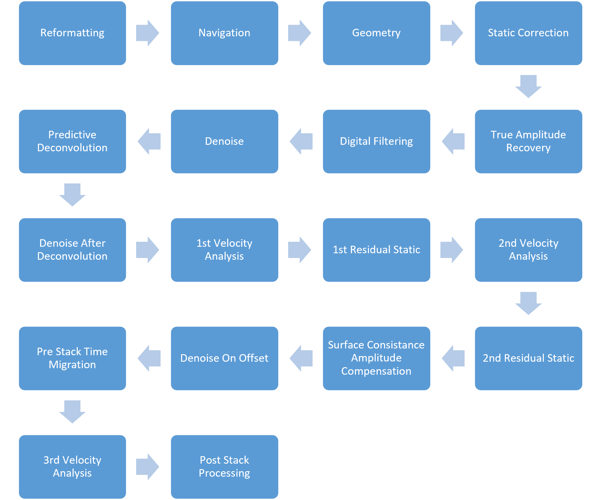
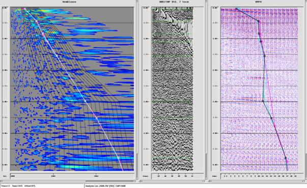
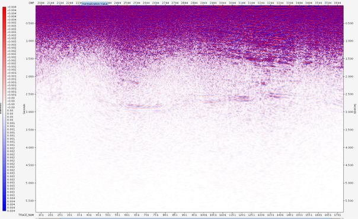
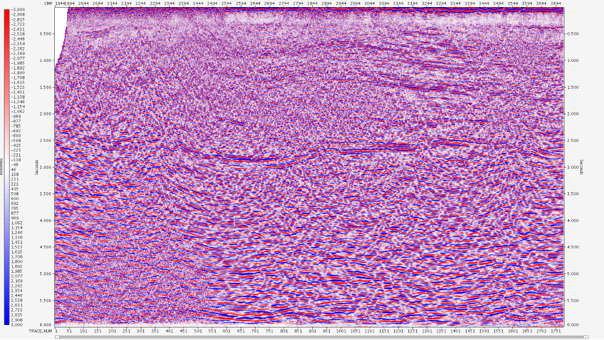

# 2D Seismic Reflection Data Processing with OMEGA

My internship project at the Pertamina Upstream Technology Center (UTC), Jakarta, during my B.Sc. in Geophysical Engineering at Institut Teknologi Bandung. I took a raw 2D seismic data set through the full processing workflow, from SEG-Y to a migrated stack.

> **Note on documentation:** My internship report in the `documentation/` folder is written in Indonesian (Bahasa Indonesia). The methods, processing steps and results are summarised below in English.

---

## Project overview

| | |
|---|---|
| **Role** | Geophysics data processing intern (one month, 23 attendance days recorded) |
| **Organisation** | Pertamina Upstream Technology Center (UTC), Jakarta |
| **Period** | 9 July – 9 August 2018 |
| **Input data** | Raw 2D seismic data in SEG-Y format, with the observer report; navigation (ASCII) file made by the acquisition team |
| **Software** | OMEGA seismic processing software; PickWorks Lite (inside OMEGA) for first-break picking |
| **Result** | Stacked seismic sections: one with preserved amplitudes and one with AGC (non-preserved) |
| **Skills used** | Seismic reflection processing, filtering, denoising, deconvolution, static corrections, velocity analysis, migration, stage-by-stage quality control (QC) |

## Goals

1. Learn the seismic processing workflow used in industry.
2. Turn raw field data into a seismic section that shows the subsurface and is ready for interpretation.

## Why processing is needed

Raw field recordings cannot show the subsurface directly. They contain noise (for example background noise and ground roll), amplitudes that fade with distance because the wave energy spreads out (spherical divergence), and timing shifts caused by elevation and the weathered near-surface layer. Processing removes or reduces these effects step by step, so that reflections from the subsurface layers become visible in a section.

---

## What I did

The workflow had 18 stages in my report; navigation and geometry are listed together here, so the table has 17 rows. After every stage I checked the result (QC) on stacks, shot gathers and CMP gathers. Before the first velocity analysis, my QC stacks used a single velocity taken from the average velocities.

| # | Stage | What I did and why |
|---|---|---|
| 1 | **Reformatting** | Converted the SEG-Y data to the `.DIO` format that OMEGA processes. |
| 2 | **Navigation and geometry** | Gave each trace its receiver, shot and station number and the survey configuration, from an ASCII file made by the acquisition team. |
| 3 | **Static correction** | Picked first breaks on every shot gather with PickWorks Lite and used the picks for the static correction, which removes the effects of elevation and the weathered (soft) near-surface layer. |
| 4 | **True amplitude recovery (TAR)** | Restored amplitude and energy lost to spherical divergence. |
| 5 | **Digital filtering** | Suppressed unwanted frequencies; here, signals affected by aliasing. |
| 6 | **Denoise (AAA, anomalous amplitude attenuation)** | Removed amplitudes judged anomalous within a window of data. It works well where noise is present but not dominant. |
| 7 | **Predictive deconvolution** | Reduced the effect of the source wavelet, to move closer to the reflection coefficients. I compared two window sizes (4 and 32): window 32 made deeper data clearer, while window 4 resolved shallow data better. I used window 32 because the target was deeper. |
| 8 | **Denoise after deconvolution** | Repeated the denoise step on the deconvolved data to reduce noise further. |
| 9 | **1st velocity analysis** | Picked velocities on the semblance (highest energy) so that events in the CMP gather become flat. QC windows: mini stack, brute stack and NMO isovelocity display. The resulting stack was **worse** than the single-velocity stack because my picking was not accurate enough. |
| 10 | **1st residual statics** | Corrected short-wavelength statics that the elevation and refraction statics did not solve, by shifting shots and receivers in time so that neighbouring traces line up. |
| 11 | **2nd velocity analysis** | Repeated the velocity analysis after the 1st residual statics. |
| 12 | **2nd residual statics** | Repeated the residual statics after the 2nd velocity analysis. |
| 13 | **SCAC (surface-consistent amplitude compensation)** | On the left side of the section almost no data was visible below about 1000 ms, possibly because hard rock near the surface reflected most of the energy. After SCAC, data became visible there and comparable with the right side. |
| 14 | **Denoise on offset** | Denoised common-offset gathers: noise that is concentrated in CMP or shot gathers is spread out there, so more of it can be removed. |
| 15 | **Pre-stack time migration (PSTM)** | Moved reflectors to their correct position and removed diffraction effects. Done before stacking, so the data stay amplitude-preserved and velocity analysis is still possible afterwards. |
| 16 | **3rd velocity analysis** | Velocity analysis on the migrated data. After this stage the processing is finished; amplitudes are preserved, so analyses such as AVO remain possible. |
| 17 | **Post-stack processing** | TVF (time-varying filter) to reduce ambient noise, and AGC (automatic gain control) to balance amplitudes over the whole section. |

---

## Results

I produced two final sections:

- **Preserved-amplitude section** (migrated stack after the 3rd velocity analysis, shown after TVF). Amplitudes keep their original values, so the section can be used for further analysis such as AVO.
- **Non-preserved-amplitude section** (stack after AGC). Amplitudes are balanced over the whole section, which makes horizons easier to pick for an interpreter, but the amplitudes no longer represent the real values.

The sections show information down to a considerable depth. Their resolution is limited because the data contain mainly low frequencies; my report notes that this is typical of the area.

## Visual gallery

### The processing workflow


### Raw data and velocity analysis QC

| Raw shot gather (SEG-Y converted to DIO) | Velocity analysis screen (semblance, CMP gather and QC stack panels) |
|---|---|
|  |  |

### Final sections

| Preserved amplitude (after TVF) | Non-preserved amplitude (after AGC) |
|---|---|
|  |  |

---

## What I learned

- Seismic processing follows a fairly standard sequence of steps, but every data set needs its own handling depending on the problems it shows.
- The parameters depend on the target. For example, I chose the deconvolution window of 32 to bring out deeper data, at the cost of shallow resolution compared with window 4.
- Understanding the geology of the survey area is needed, especially during velocity analysis.
- Velocity picking needs practice: my first velocity analysis gave a worse stack than the single velocity because the picks were not accurate. I recommended more picking practice and more study of the geology of the survey area.

## Repository contents

```text
.
├── README.md
├── documentation/   # my internship report (Indonesian)
└── assets/          # figures used in this README
```

## Author

Fashli Adli Wal Ikhsan · [github.com/fashliadli](https://github.com/fashliadli)
